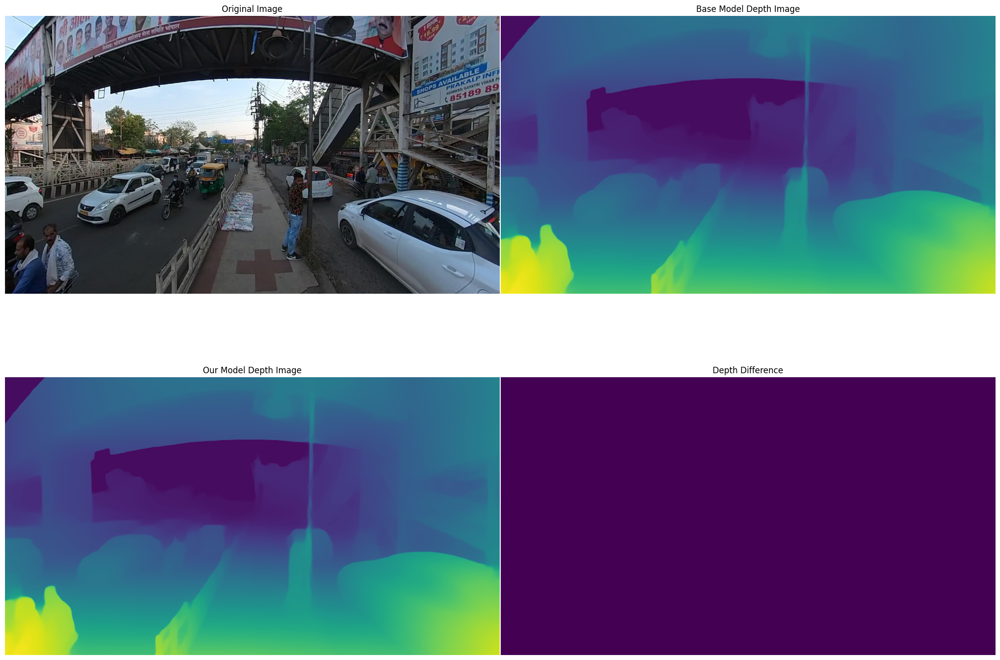
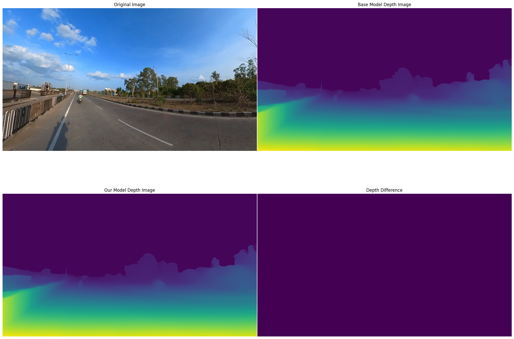
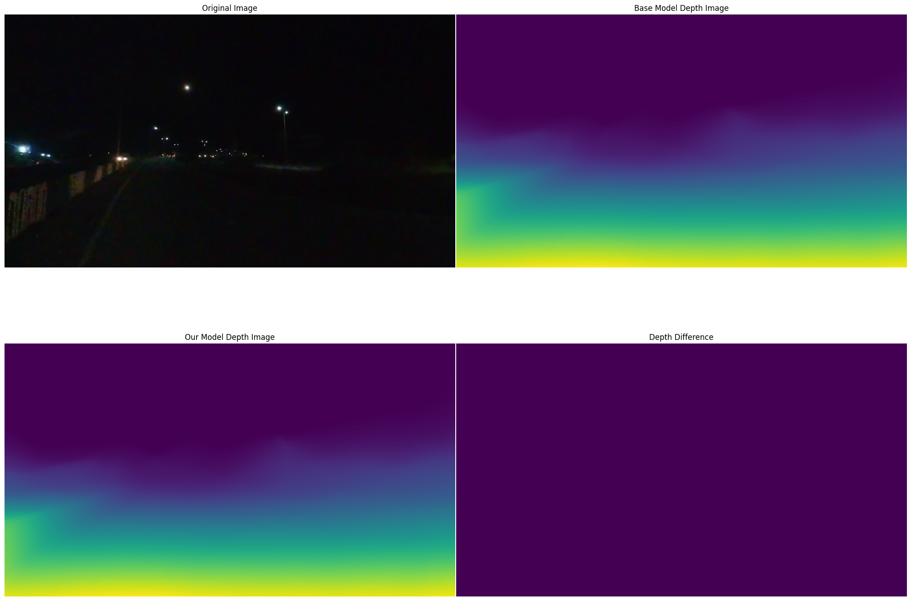
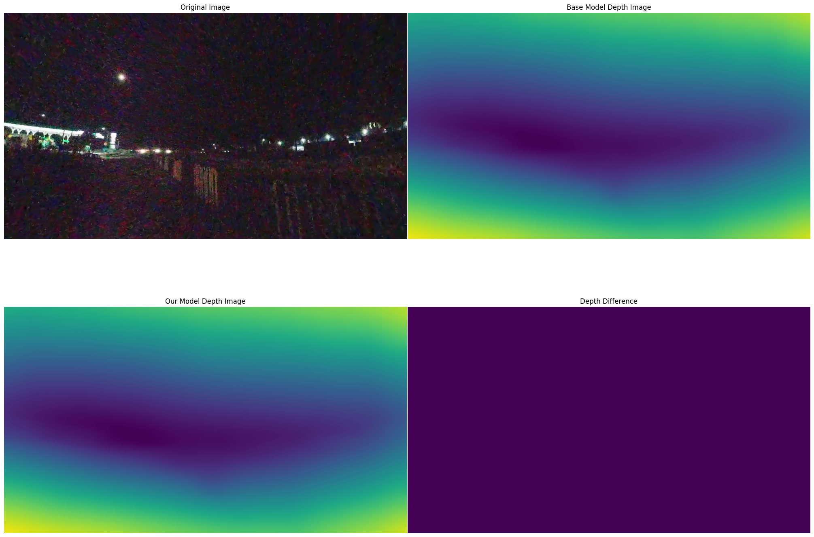

# Development of Depth Maps for Outdoor Images

This project focuses on improving depth map generation for outdoor scenes, particularly addressing the challenges of nighttime imaging. We propose and evaluate two distinct approaches to enhance depth estimation quality for low-light conditions.

## 🌟 Features

- Domain adaptation approach using DepthAnything model
- Nighttime image enhancement pipeline
- Support for various enhancement algorithms
- Comparative analysis of depth map quality
- Tested on real-world dataset from Bhopal, India

## 📊 Results

### Daytime vs Nighttime Depth Maps

*Comparison of depth maps for various scenes: (a) busy daytime (b) empty daytime (c) busy nighttime (d) empty nighttime (e) noisy nighttime*

### Domain Adaptation Results

*Results on a busy night-time scene showing actual scene, depth map from DepthAnything v1, difference in depth maps, and depth map from our encoder*

### Image Enhancement Results

*Results showing enhanced nighttime images along with their corresponding depth maps using various algorithms*

## 🛠️ Approaches

### 1. Domain Adaptation Based
- Uses DepthAnything model architecture
- Fine-tuning and training from scratch experiments
- PatchGAN-based adversarial learning
- Unsupervised approach for feature space alignment

### 2. Nighttime Image Enhancement Based
Implemented various enhancement algorithms including:
- Naturalness Preserved Enhancement (NPE)
- Low-Light Image Enhancement (LIME)
- Fusion-Based Enhancement (FBE)
- Bio-Inspired Multi-Exposure Fusion (BIMEF)
- Robust Retinex Model (RRM)
- And more...

## 📈 Performance

Best results were obtained using:
- NPE (Naturalness Preserved Enhancement)
- FOF (Fractional-Order Fusion)
- CR (Camera Response Model)

## 🚧 Limitations

- Limited dataset size affecting domain adaptation
- Subjective evaluation metrics
- Noise amplification in enhancement
- Loss of texture and detail
- Over-saturation issues in extreme cases

## 🔮 Future Work

- Combining both approaches for robust performance
- Testing with larger datasets
- Exploring extreme weather conditions
- Improving evaluation metrics
- Optimizing hyperparameters

## 📚 References

1. Basheer, O., & Al-Ameen, Z. (2024). Nighttime Image Enhancement: A Review of Topical Concepts. SISTEMASI, 13, 1073.
2. Oquab, M., et al. (2024). DINOv2: Learning Robust Visual Features without Supervision.
3. Vankadari, M., et al. (2020). Unsupervised Monocular Depth Estimation for Night-time Images using Adversarial Domain Feature Adaptation.
4. Yang, L., et al. (2024). Depth Anything V2.
5. Yang, L., et al. (2024). Depth Anything: Unleashing the Power of Large-Scale Unlabeled Data.

## 👥 Authors

- Devashish Tripathi (devashish21@iiserb.ac.in)
- Aditya Kishore (adityak21@iiserb.ac.in)
- Snehal Mahajan (mahajan20@iiserb.ac.in)

## 📄 License

This project is licensed under the MIT License - see the [LICENSE](LICENSE) file for details.
